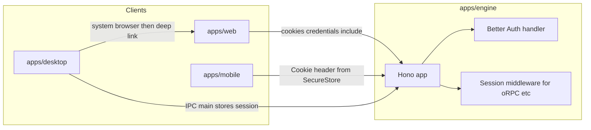

# Better Auth across Web, Electron, and Expo

## Architecture

- **Source of truth**: One Better Auth instance on the server ([Hono integration](https://better-auth.com/docs/integrations/hono)): mount `auth.handler` on `GET`/`POST` `/api/auth/*`, register **`cors()` before routes** with `credentials: true` and explicit `origin` allowlist matching each client origin in dev and prod.
- **Web**: Normal Better Auth client (`createAuthClient` from `better-auth/react` or `better-auth/client`) with `baseURL` pointing at the engine API origin; for cross-port dev, clients must use **`credentials: 'include'`** (and matching server CORS), per [Hono client notes](https://better-auth.com/docs/integrations/hono).
- **Electron**: Follow [Electron integration](https://better-auth.com/docs/integrations/electron): server plugin `electron()`, web app gets **`electronProxyClient`**, desktop main process uses **`electronClient`** + **`authClient.setupMain()`** before `app.ready`, preload calls **`setupRenderer()`** from `@better-auth/electron/preload`. **Do not** expose raw `authClient` to the renderer; use documented IPC bridges (`requestAuth`, `signOut`, etc.). Register **custom protocol** in [Electron Forge `packagerConfig.protocols`](apps/desktop) and add the same scheme to **`trustedOrigins`** on the server (e.g. `com.yourorg.ordo:/`). Align **`signInURL`** with the real URL of your sign-in route on `apps/web` (local + production).
- **Expo**: Follow [Expo integration](https://better-auth.com/docs/integrations/expo): server plugin `expo()`; app installs **`better-auth`**, **`@better-auth/expo`**, **`expo-secure-store`**, **`expo-network`**, and client uses **`expoClient`** with **`SecureStore`** and **`baseURL`** to the engine. Set **`trustedOrigins`** to your app scheme(s) from `app.json` / `app.config` (e.g. `ordo://`) and tighten dev-only `exp://` patterns as in the docs. For authenticated non-auth calls (oRPC/fetch), reuse the pattern **`authClient.getCookie()`** in headers with **`credentials: 'omit'`** as documented.

**Compatibility note:** Official Expo docs target **SDK 55**; your [apps/mobile/package.json](apps/mobile/package.json) is on **SDK 54**. Plan either: upgrade mobile when you implement auth, or verify `@better-auth/expo` behavior on 54 before locking in.

**Runtime note:** [apps/engine](apps/engine) targets **Cloudflare Workers** (Wrangler + Vite). Before implementation, confirm your chosen **Better Auth database adapter** and session storage match Workers (e.g. D1 + KV) and that `better-auth` execution is supported in that environment; if not, the fallback is a Node-compatible API (separate service) with the same client config.

## Offline auth, TanStack DB, and how this plan fits

**Short answer:** The three-client Better Auth plan is still the right **online identity** foundation. It does **not** by itself give you cryptographically proven “offline login” to the server; instead you combine it with **locally cached session state** and **user-scoped local data** (TanStack DB) so the app remains usable offline after a successful online session.

| Concern | Online | Offline |
|--------|--------|--------|
| Sign-in, OAuth, password flows | Required (Better Auth on `engine`) | Not available without network; show queued / read-only UX |
| Session validity / refresh | Server + client | Client can **read** cached session; **refresh** and **server verification** wait until network |
| Who is the current user (for UI + DB scoping) | `getSession` / hooks | Use **last known** user id + session metadata from client cache (Expo already caches in SecureStore; Electron in main storage; web needs an explicit small cache, e.g. IndexedDB + careful handling) |
| TanStack DB reads/writes | Sync/replicate when connected | Fully local; **scope collections by `userId`** from cached session so data does not leak across accounts on a shared device |

**Design rules to add to implementation:**

1. **Single user scope for local data:** When TanStack DB initializes, bind to `cachedSession.user.id` (or null → guest / login wall). On sign-out, clear or isolate local DB for that user per your product rules.
2. **Offline is “optimistic identity”:** Treat cached session as **UX + client authorization** only. Anything that must be server-authoritative (payments, admin, irreversible actions) should **queue** until online or be disabled offline.
3. **Reconnect path:** When the app comes online, call **`getSession` / refresh** (or your Better Auth client equivalent); if session expired or revoked, clear cache, update TanStack DB visibility, and prompt re-login.
4. **Web vs native:** Native clients (Expo/Electron) match this model well because integrations already persist cookies/session in secure storage. **Browser** offline is the hardest: prefer a minimal **session snapshot** (user id, expires at) for gating only, not long-lived secrets in `localStorage` without a threat model review.

So: **yes**, the current multi-client plan **works with** offline-first TanStack DB **if** you explicitly add the offline session mirror + user-scoped DB policy above; TanStack DB handles **data** offline; Better Auth handles **identity** when online and **cached identity** between syncs.

## TanStack DB 0.6 alignment ([persistence & includes release](https://tanstack.com/blog/tanstack-db-0.6-app-ready-with-persistence-and-includes))

Target **@tanstack/db 0.6+** so local state is **durable SQLite** across your stack (browser via SQLite WASM, **Expo/React Native** via e.g. `@op-engineering/op-sqlite` + `@tanstack/react-native-db-sqlite-persistence`, **Electron**, etc.—same mental model per runtime adapter).

**Persistence + sync (fits Better Auth + `engine`):**

- Wrap synced collections with **`persistedCollectionOptions`** (see blog examples): provides a durable local base for fast startup, offline reads/writes, and reconciliation when the network returns. **Server remains authoritative** for synced data; persistence does not change that.
- Use **`schemaVersion`** deliberately: bumping it for **synced** collections clears the local copy and triggers **re-sync** from the server (good after breaking schema changes). For **local-only** collections, a version bump throws unless you handle migration explicitly.
- Pair with **`@tanstack/offline-transactions`** for durable local-first mutation flows (as in the RN shopping list demo referenced in the post).

**Auth integration (user scoping):**

- Put **`userId` in the SQLite database name or collection namespace** (e.g. `tanstack-db-${userId}.sqlite`) so switching accounts or post-logout does not leak rows between users on one device. Align with the offline session mirror: open the right DB only after you know `cachedSession.user.id`, or close/swap DB on logout.

**UI / sync UX primitives (optional but useful):**

- **`includes`**: hierarchical projections from normalized collections (GraphQL-like shape on the client) without N+1; keeps fine-grained reactivity via child collections or **`toArray()`** when you want a materialized array.
- **Virtual props** (`$synced`, `$origin`, etc.): outbox views, delivery indicators, and queries over optimistic vs confirmed rows—useful with offline writes.
- **`createEffect`**: reactive side effects on live query deltas (workflows, sync follow-ups).
- **`queryOnce`**: one-shot reads with the same query language as live queries (loaders, exports).

**Upgrade / API hygiene (0.6):**

- **Indexes are opt-in** (`defaultIndexType`, `autoIndex`); bundle excludes indexing until configured.
- **Mutation handlers**: remove reliance on “magic return”; use explicit **`collection.utils.refetch()`** (Query collections) or **`awaitTxId`** (Electric-style) as in the post’s migration notes.
- **SSR**: still evolving toward v1; if `apps/web` needs SSR + DB hydration, track TanStack’s SSR design—may affect how you split “shell” vs client-persisted DB.

## Monorepo layout (concrete steps)

1. **`apps/engine`**
   - Add `better-auth`, `@better-auth/electron`, `@better-auth/expo`, DB adapter deps as required.
   - Add `auth` module (e.g. `src/auth.ts`): `betterAuth({ plugins: [electron(), expo(), ...], trustedOrigins: [...] })` — include **web origins**, **Electron scheme**, **Expo scheme(s)**, and **dev Expo** entries only in development.
   - Wire Hono: `app.use('/api/auth/*', cors({ ... }))` then `app.on(['GET','POST'], '/api/auth/*', c => auth.handler(c.req.raw))`.
   - Optional: global middleware `auth.api.getSession({ headers: c.req.raw.headers })` and attach `user`/`session` to context for future oRPC/payment routes.
   - Refactor or split the current SSR `renderer` usage in [apps/engine/src/index.tsx](apps/engine/src/index.tsx) so `/api/auth/*` and API routes are not blocked by UI-only middleware.

2. **`apps/web`**
   - Add `better-auth`, `@better-auth/electron` (for proxy only).
   - `auth-client.ts`: `createAuthClient({ baseURL: PUBLIC_ENGINE_URL, plugins: [electronProxyClient({ protocol: { scheme: '...' } })] })` — scheme must match desktop + server `trustedOrigins`.
   - Sign-in / callback UI: implement **`ensureElectronRedirect()`** on the page that starts OAuth from Electron, and preserve PKCE/query via `fetchOptions.query` as in the Electron docs.

3. **`apps/desktop`**
   - Add `better-auth`, `@better-auth/electron`, and optionally `conf` for bundled storage.
   - Main: import auth client, call **`setupMain()`** early; keep **`nodeIntegration: false`**, **`contextIsolation: true`**; ensure preload path is correct for Forge+Vite.
   - Preload: **`setupRenderer()`** only from `@better-auth/electron/preload`; follow bundling guidance (do not externalize `@better-auth/electron` from preload build if your toolchain requires it bundled).
   - **Forge**: register `packagerConfig.protocols` with the same scheme.
   - Renderer: auth UX via **`window.requestAuth`**, **`window.signOut`**, subscriptions (`onAuthenticated`, `onAuthError`), not direct secret access.

4. **`apps/mobile`**
   - Add deps per Expo doc; implement `lib/auth-client.ts` with **`expoClient`** + **`SecureStore`** and engine **`baseURL`**.
   - Configure app **scheme** and server **`trustedOrigins`**.
   - For API calls: centralize headers using **`getCookie()`** (or your oRPC link `headers()` pattern from the Expo doc).

5. **Shared config (recommended)**
   - Add a small internal package (e.g. `packages/auth-config`) exporting only **public** constants: auth base path, allowed origins list builder, scheme names — **no secrets**. Apps read **`VITE_*` / `EXPO_PUBLIC_*`** for URLs.

6. **Offline session + TanStack DB 0.6 (cross-cutting)**
   - Introduce a tiny **auth session store** (or use Better Auth hooks + persistence) that exposes: `userId`, `expiresAt` / `isStale`, `isOnline` (from `expo-network` or `navigator.onLine` + probe).
   - **Per-app persistence:** instantiate the correct **SQLite adapter** (web WASM / Expo op-sqlite / Electron) and **`persistedCollectionOptions`** for collections that should survive restarts; add **`@tanstack/offline-transactions`** where you need durable offline writes.
   - **User scope:** open SQLite **`name` / paths keyed by `userId`** (or equivalent); on account switch or logout, close DB, delete files, or bump isolated `schemaVersion` strategy so data cannot leak across accounts.
   - Define product behavior: read-only offline vs full CRUD offline; when online, authenticated **queryFn** / sync to `engine` uses Better Auth cookies or headers; on reconnect, refetch session then allow sync reconciliation.

7. **Secrets and env**
   - Engine: `BETTER_AUTH_SECRET`, `BETTER_AUTH_URL` (public URL of the API), OAuth provider keys, database bindings.
   - Clients: only **public** base URL to engine; never ship secrets.

## Verification checklist

- Web: sign-in/out; session cookie on expected domain; CORS preflight for credentialed requests.
- Electron: protocol opens app; `requestAuth` completes; session in main storage; renderer receives sanitized user via bridges.
- Expo: deep link return; `useSession`; authenticated fetch/oRPC with cookie header.
- All three: same user table/session table on the server; logout invalidates consistently.
- Offline: after online login, airplane mode still shows correct user and TanStack DB data for that user; reconnect refreshes session; expired session forces re-auth and does not show another user’s data.
- TanStack DB: cold start reloads persisted SQLite; `schemaVersion` bump triggers expected re-sync or migration path; outbox / `$synced` UI matches actual sync state after reconnect.
