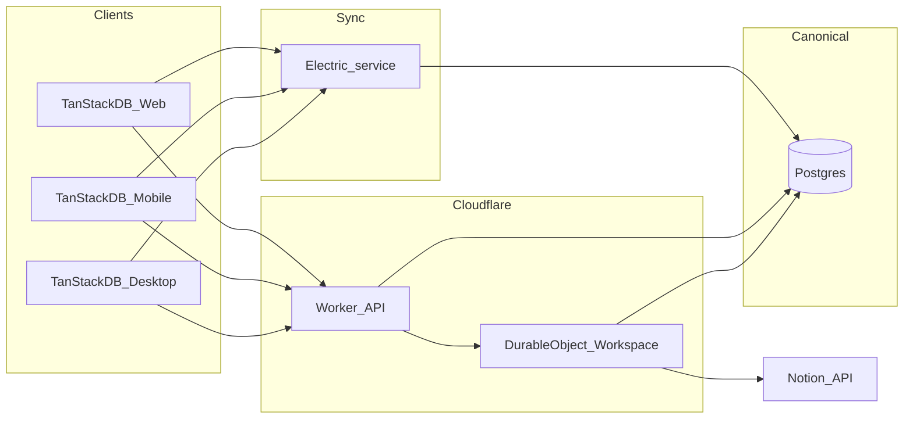
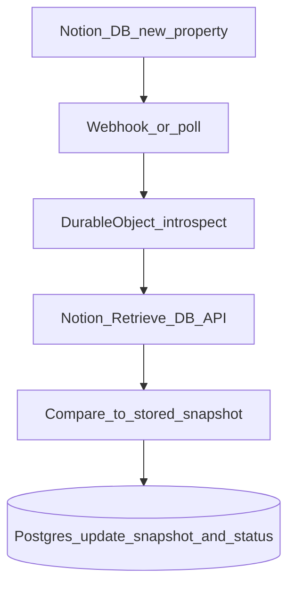

# Ordo Notion Project Manager — Greenfield Plan

## Context

You chose **greenfield in this repo** (replace/clear prior stack). The workspace snapshot had no discoverable `package.json` / apps on disk; execution phase should verify checkout and remove or archive any leftover non-goals (e.g. legacy marketing-only apps) per your product scope.

## Monorepo and Turborepo

- **Layout**
  - [`apps/web`](apps/web): React 19 + Vite + TanStack Router; primary UI.
  - [`apps/mobile`](apps/mobile): Expo; consumes `@ordo/domain`, `@ordo/db`, mobile-specific screens—not a single shared UI tree for every screen.
  - [`apps/desktop`](apps/desktop): Electron loading the **built** web app (or dev URL) with desktop chrome (menus, window state persistence later).
  - [`apps/api`](apps/api): Hono (or minimal fetch router) on **Cloudflare Workers**; auth session/JWT, Notion OAuth, REST/oRPC surface, Electric shape **proxy** (if you hide Electric behind the Worker), webhook intake, enqueue to DOs.
  - [`packages/domain`](packages/domain): Zod schemas, branded IDs, enums (`ProjectStatus`, `TaskStatus`, `SyncSource`, `SyncState`, `NotionMirrorMode`), pure conflict/timestamp helpers.
  - [`packages/db`](packages/db): TanStack DB collection definitions, mutation contracts, Electric collection wiring, **runtime-specific persistence adapters** re-exported or configured per app (web: IndexedDB/SQLite per TanStack DB guidance; mobile: Expo SQLite or recommended adapter; desktop: same as web under Electron).
  - [`packages/ui`](packages/ui): tokens + primitives shared where sensible; web vs mobile presentation stays split at route/feature level.
  - [`packages/notion-sync`](packages/notion-sync): property map for managed `Projects` / `Tasks` DBs, push/pull translators, degraded-state detection (schema drift).
  - [`packages/config`](packages/config): shared `tsconfig`, ESLint flat config, Tailwind preset, env parsing (e.g. Zod at app boundaries).

- **Turborepo conventions** (align with Turborepo skill): define **scripts in each package**; root [`package.json`](package.json) only runs `turbo run …`; [`turbo.json`](turbo.json) registers `build`, `lint`, `typecheck`, `test`, `dev` with correct `dependsOn`, `outputs`, and `persistent` for dev servers.

## Data plane: Postgres, Electric, TanStack DB

- **Tables** (initial Drizzle or SQL migrations in repo, applied to hosted Postgres): `workspaces`, `projects`, `tasks`, `notion_connections`, `notion_project_mappings`, `notion_task_mappings`, `sync_job_log`, `webhook_receipts`—plus indexes on foreign keys and `(workspace_id, updated_at)` for reconciliation ordering.
- **Electric**: one shape (or small set of shapes) per logical sync surface—e.g. workspace-scoped `projects`, `tasks`, mapping tables the client needs for status UI. **RLS or strict WHERE** on shapes so a client only ever subscribes to its workspace; Worker-issued tokens or Electric proxy auth must enforce that.
- **TanStack DB**: optimistic local writes first; mutation pipeline calls Worker `POST/PATCH` for projects/tasks; server persists to Postgres; Electric replication brings canonical rows to all devices. **Notion path never blocks** the mutation response—only Postgres persistence + ack.

## Cloudflare: Worker + Durable Objects

- **Per-workspace DO** (or keyed namespace): single-writer queue for Notion API calls, dedupe keys for webhooks, serialized bootstrap/reconcile, retry with backoff, append-only **event stream** for jobs/audit (your “stream-style” processing).
- **Webhook** `POST /webhooks/notion`: verify signature, insert `webhook_receipts` idempotently, enqueue pull job to DO; return 200 quickly.
- **OAuth**: `POST /auth/notion/connect` (start), `GET /auth/notion/callback` (exchange, store tokens in `notion_connections` or encrypted blob in Postgres).
- **Sync control**: `POST /sync/notion/bootstrap`, `POST /sync/notion/reconcile`, `GET /sync/notion/status`—handlers validate workspace, enqueue DO work, read status from DO + `sync_job_log`.
- **CRUD**: `POST/PATCH` for projects and tasks as specified; implementations write Postgres, optionally emit “changed row” hints to DO (or DO polls `sync_job_log` / outbox table).

## Notion integration (MVP rules)

- **One Notion workspace per app workspace**; app **creates** managed `Projects` and `Tasks` databases and properties (titles, status enums mapped to select/status types Notion supports, due date, archive/completed semantics as you defined).
- **Mappings**: `notion_project_mappings` / `notion_task_mappings` store internal UUID ↔ Notion page id; translators live in `@ordo/notion-sync`.
- **Pull allowed fields only**: project name, task name, task status, due date, archived/completed—everything else Postgres wins; conflicts resolved by latest server timestamp with `sync_job_log` row.
- **Schema drift**: connection `degraded`; require `bootstrap` re-run rather than heuristic repair.

### Notion schema evolution (e.g. new property in Notion)

**Postgres does not automatically "pick up" Notion property changes.** Electric replicates *your* relational schema; a new Notion column does not create a new Postgres column by itself. You need an explicit **detection** path and a **data model** choice:

1. **How you learn Notion changed**
   - **Notion webhooks** (e.g. database-level events where applicable) enqueue a **schema-introspection job** in the per-workspace DO: call Notion’s API to retrieve the current database `properties` map for the managed `Projects` / `Tasks` databases.
   - **Periodic or on-reconcile** introspection: same API call, even if the user never touches webhooks (slower, simpler).
   - **Compare** the retrieved property set + types to a **snapshot stored in Postgres** (e.g. on `notion_connections`: `notion_schema_hash`, `notion_db_properties` JSONB, or a small `notion_schema_versions` table). Any unexpected property → drift signal.

2. **What you do in Postgres (policy, not magic)**
   - **MVP (fixed mirror)**: only **allow-listed** property IDs map to columns you already have (`title`, `status`, `due date`, etc.). A **new** property in Notion is either **ignored** for sync until you ship code + migration to support it, or it immediately marks the connection **degraded** (strict mode).
   - **Flexible add-on (optional)**: add a `notion_extras` **JSONB** (or an EAV table) for "Notion-only / extended" key-values so you can store new Notion fields without a migration for *every* new Notion property—then decide what syncs to the app model and to Electric Exposed client shapes.
   - **App-owned new fields**: if the product adds a new concept, you **migrate Postgres** (new column or JSON) and **update** `@ordo/notion-sync` mappers; then re-bootstrap or run a one-time backfill in Notion if you also add that property in Notion.

3. **End-to-end flow**

**Summary:** "Pick up" = **Worker/DO** runs **Notion database introspection**, updates **metadata in Postgres** (and optionally `sync_job_log`), then either continues mirroring only mapped fields, extends your canonical model via migration + mapper update, or sets **degraded** until an admin re-bootstrap.

## Client UX scope (MVP)

- Views: inbox, project list/detail, task list, Kanban by status, sync status panel.
- Actions: CRUD/archive projects; CRUD/complete/reorder/move tasks; bulk complete/archive.
- Local-only collections: filters, drafts, last-opened (TanStack DB local collections, not Electric-backed).

## Testing (layered)

- **Unit/domain** (`packages/domain`, `packages/notion-sync`): Zod validation, mapping round-trips, soft-delete/archive, conflict ordering helpers.
- **API/integration**: Worker routes with Miniflare or `wrangler dev`; DO idempotency (`webhook_receipts`); Notion client mocked or contract-tested.
- **Sync**: scripted scenarios—offline mutations, reconnect, assert Postgres state and shape convergence; multi-device propagation (two clients, same workspace).
- **Platform smoke**: web offline reload; Expo restart with queued mutations; Electron relaunch (when desktop phase lands).

## Delivery alignment to your phases

1. **Foundation**: Turborepo root, `turbo.json`, shared `config`, minimal shells for web/mobile/desktop/api; Postgres schema + migration runner; Electric project wired to that DB; `packages/db` with one vertical slice (e.g. `projects` read path + one mutation).
2. **Core product**: full project/task domain, optimistic mutations, views + Kanban, sync status UI, soft deletes.
3. **Notion**: OAuth, bootstrap (create DBs + mappings), push pipeline from DO, webhooks + pull jobs, minimal “reconcile status” UI.
4. **Hardening**: retries, degraded states, observability (structured logs + `sync_job_log` queries), E2E offline/sync tests in CI.

## Execution risks to validate early

- **TanStack DB + Electric**: confirm the exact integration pattern and storage adapters for web vs Expo against current docs (APIs move quickly); spike a **single table** shape end-to-end before building full UI.
- **Postgres hosting**: pick Neon/Supabase/similar + migration story; Workers connect via **HTTP driver** or small Node-compat service if needed—decide in Phase 1 spike.
- **Electron + Vite**: define load URL vs `file://` build, CSP, and deep links for OAuth return if not fully Worker-hosted.

## Out of scope (per your doc)

Multi-user permissions, rich Notion-only constructs, comments/attachments/subtasks, hard deletes, arbitrary user Notion schemas.
